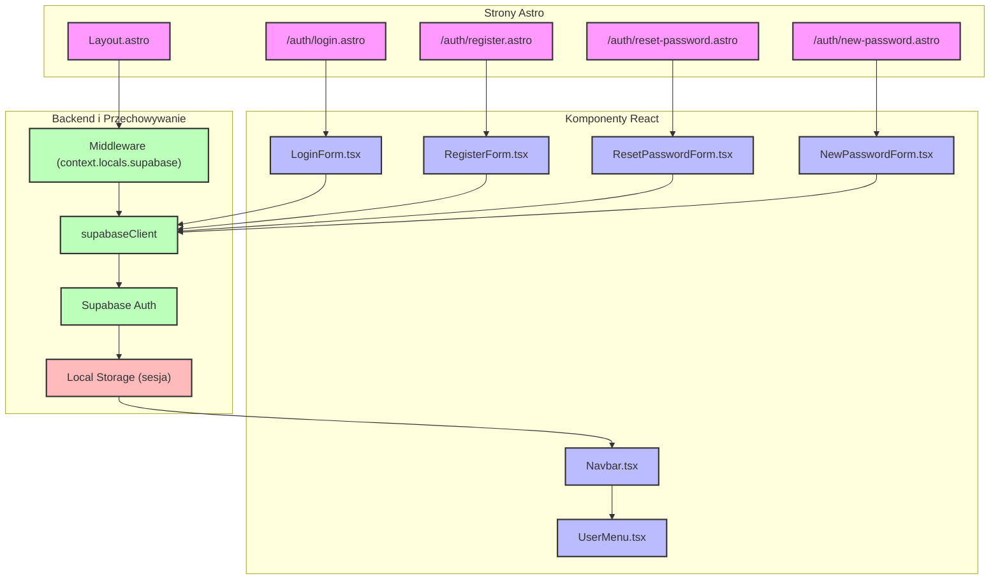

# Diagram przepływu autentykacji w 10x-cards

## Komponenty i przepływ autentykacji

## Opis przepływu

1. Użytkownik wchodzi na jedną z czterech stron autentykacji:
   - `/auth/login.astro` - logowanie
   - `/auth/register.astro` - rejestracja
   - `/auth/reset-password.astro` - resetowanie hasła
   - `/auth/new-password.astro` - ustawianie nowego hasła

2. Każda strona zawiera odpowiedni komponent React do obsługi formularza:
   - `LoginForm.tsx` - formularz logowania
   - `RegisterForm.tsx` - formularz rejestracji
   - `ResetPasswordForm.tsx` - formularz resetowania hasła
   - `NewPasswordForm.tsx` - formularz nowego hasła

3. Komponenty formularzy komunikują się z Supabase Auth poprzez `supabaseClient`:
   - Walidacja danych formularza (React Hook Form + Zod)
   - Wysyłanie żądań do Supabase Auth
   - Obsługa odpowiedzi i błędów

4. Po udanej autentykacji:
   - Supabase Auth zapisuje token sesji w Local Storage
   - Użytkownik jest przekierowywany do strony głównej
   - `Navbar.tsx` wyświetla `UserMenu.tsx` z opcjami użytkownika

5. Middleware (`context.locals.supabase`):
   - Zapewnia dostęp do `supabaseClient` we wszystkich komponentach
   - Automatycznie dołącza token sesji do żądań API

6. Layout (`Layout.astro`):
   - Zawiera główny układ aplikacji
   - Wyświetla `Navbar` z odpowiednim stanem autentykacji
   - Zarządza przekierowaniami dla chronionych tras
